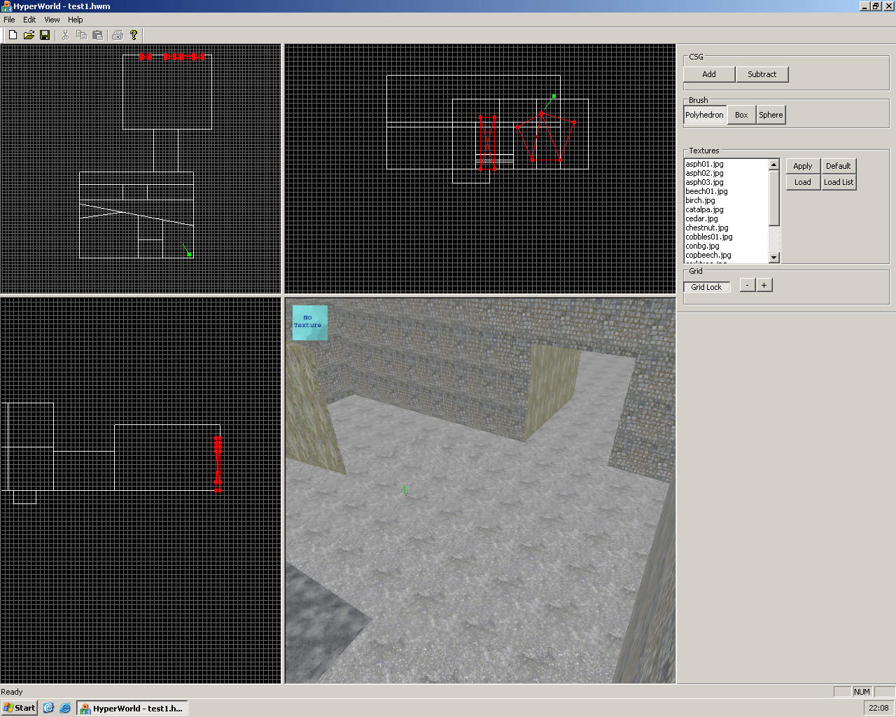

# VERY OLD: Hyper game engine (my first 3D engine attempt)

One of those very old projects from around the early 2000s where I used to program 3d game stuff with C++ on Windows. Unfortunately I can neither build nor run this anymore, since I think it requires a Windows version before NT and the Visual C++ 5 or 6 IDE.

Screenshot of the map editor called "HyperWorld".

It works a bit like the old Half-Life map editor "WorldCraft". It uses CSG (constructive solid geometry) operations to shape the world.
The actual engine uses Direct3D and a BSP tree with dynamic plane shifting for collision detection.